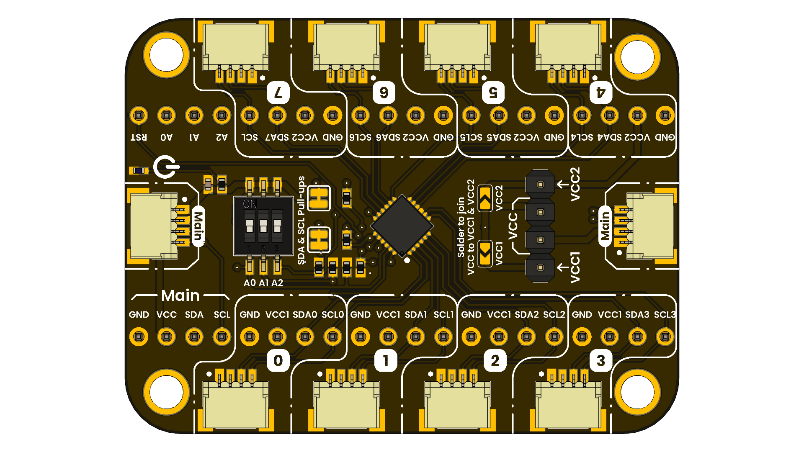

# DevLab: I2C TCA9548A Multiplexer Module

## Introduction

The TCA9548A is a 1-to-8 bidirectional translating switch controlled via the I2C bus. It is designed to resolve I2C address conflicts and expand the fan-out capability of a primary I2C bus master.

The device consists of eight separate downstream channels (SCL0/SDA0 through SCL7/SDA7) that can be selected individually or in any combination via a programmable Dip Switch. This allows a master device to communicate with multiple peripheral devices sharing the same I2C address by isolating them on separate channels.

Each channel has pin header interface and also a QWIIC Connector for rapid development.

  
  
<em>TCA9548A Multiplexer Module</em>

### Quick Setup

## Overview

| Feature         | Description                           |
|-----------------|---------------------------------------|
| Main IC         | TCA9548A                              |
| Channels        | 8 Bidirectional                       |
| Clock frequency | Up to 400 kHz                         |
| Power Supply    | Qwiic Connector and pin header        |
| Interfaces      | I2C Bus and SMBus compatible          |
| Expansion Port  | I2C connector for sensors and modules |

I2C Address: 0x70 to 0x77

## Applications

- **Prototyping:** Quickly develop and test ideas.
- **Address Conflict Resolution:** Interfacing with multiple sensors possessing identical, fixed I2C addresses.
- **Voltage Level Shifting:** Interfacing 5V microcontrollers with 3.3V peripheral sensors.
- **Bus Capacitance Management:** Isolating bus capacitance by segmenting long I2C buses into smaller, manageable sub-segments.
- **System Reliability:** Isolating faulty I2C devices to prevent total bus lockup.

## Resources

- [Schematic Diagram](./hardware/unit_schematic_v_1_0_0_ue0114_devlab_i2c_tca9548a_multiplexer_module.pdf)
- [Pinout Diagram](./hardware/unit_pinout_v_1_0_0_ue0114_devlab_i2c_tca9548a_multiplexer_module_en.pdf)
- [Getting Started Guide](#)

## 📝 License

All hardware and documentation in this project are licensed under the **MIT License**.  
See [`LICENSE.md`](LICENSE.md) for details.

  Template created by UNIT Electronics

