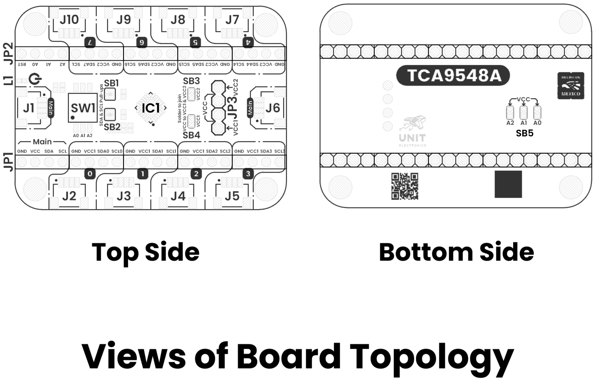
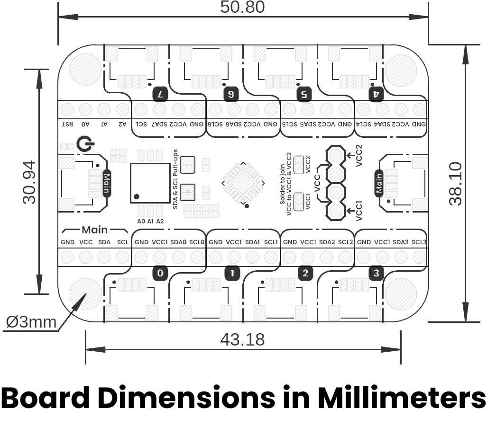

# Hardware

<a href="./unit_schematic_v_1_0_0_ue0114_devlab_i2c_tca9548a_multiplexer_module.pdf"> Schematic</a>

## Key Technical Specifications

| **Parameter** |           **Description**            | **Min** | **Max** | **Unit** |
|:-------------:|:------------------------------------:|:-------:|:-------:|:--------:|
|      Vin      | Input voltage to power on the module |  1.65   |   5.5   |    V     |
|      Vih      |       High-level input voltage       | 0.7xVin | Vcc+0.5 |    V     |
|      Vil      |       Low-level input voltage        |  -0.5   | 0.3xVin |    V     |
|      Icc      |            Supply Current            |  -100   |   100   |    mA    |
|      Ii       |            Input Current             |  -0.5   |    7    |    mA    |
|      Io       |            Output Current            |   -25   |    -    |    mA    |
|     fscl      |         I2C clock frequency          |    0    |   400   |   kHz    |

### I2C Address Selection

The address is selected via Dip Switch on board:

| **A2** | **A1** | **A0** | **Address** |
|:------:|:------:|:------:|:-----------:|
|   L    |   L    |   L    |    0x70     |
|   L    |   L    |   H    |    0x71     |
|   L    |   H    |   L    |    0x72     |
|   L    |   H    |   H    |    0x73     |
|   H    |   L    |   L    |    0x74     |
|   H    |   L    |   H    |    0x75     |
|   H    |   H    |   L    |    0x76     |
|   H    |   H    |   H    |    0x77     |

## Pinout

    <a href="#"> Pinout</a>
     
     
     
    

| Pin Label | Function    | Notes                             |
|-----------|-------------|-----------------------------------|
| VCC       | Power Supply| 3.3V or 5V                       |
| GND       | Ground      | Common ground for all components  |

## Pin & Connector Layout
| Pin   | Voltage Level | Function                                                  |
|-------|---------------|-----------------------------------------------------------|
| VCC   | 3.3 V – 5.5 V | Provides power to the on-board regulator and sensor core. |
| GND   | 0 V           | Common reference for power and signals.                   |
| SDA   | 1.8 V to VCC  | Serial data line for I²C communications.                  |
| SCL   | 1.8 V to VCC  | Serial clock line for I²C communications.                 |

> **Note:** The module also includes a Qwiic/STEMMA QT connector carrying the same four signals (VCC, GND, SDA, SCL) for effortless daisy-chaining.

## Topology

<a href="./resources/unit_topology_v_1_0_0_ue0114_devlab_i2c_tca9548a_multiplexer_module.png">  Topology</a>
 
 
 

| Ref.           | Description                         |
|----------------|-------------------------------------|
| IC1            | TCA9548A                            |
| J1 & J6        | Main I2C device QWIIC connector     |
| J2-J5 & J7-J10 | QWIIC Connector for each channel    |
| JP1 & JP2      | 2.54 mm Castellated Holes           |
| JP3            | Voltage selector for all channels   |
| SW1            | Dip Switch for address selection    |
| SB1            | SDA Pull-Up Bridge                  |
| SB2            | SCL Pull-Up Bridge                  |
| SB3            | Solder bridge to join VCC2 with VCC |
| SB4            | Solder bridge to join VCC1 with VCC |
| SB5            | Solder bridge address selection     |

## Dimensions

<a href="./resources/unit_dimension_v_1_0_0_ue0114_devlab_i2c_tca9548a_multiplexer_module.png">  Dimensions</a>

# References

- <a href="https://www.ti.com/lit/ds/symlink/tca9548a.pdf?ts=1765490049577&ref_url=https%253A%252F%252Fwww.ti.com%252Fproduct%252Fes-mx%252FTCA9548A">TCA9548A Datasheet</a>
