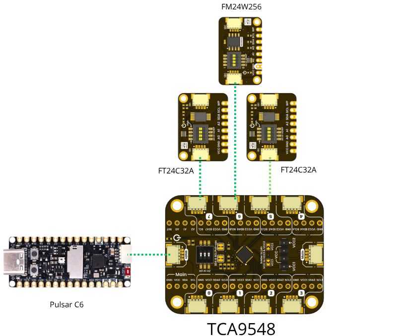
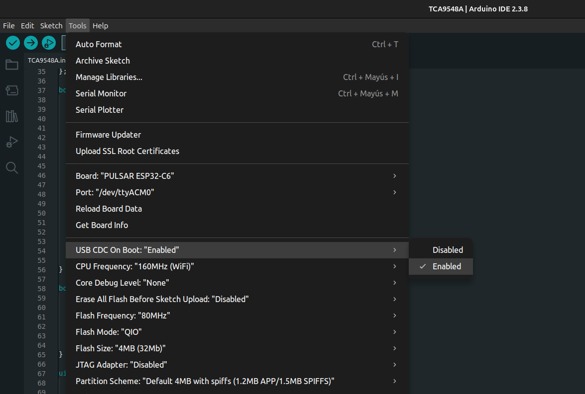

# Software

This directory contains example firmware and usage code for the **UNIT DevLab I2C TCA9548A Multiplexer Module**. The examples demonstrate how to initialize the multiplexor, select channels, and communicate with I2C devices (such as `FM24W256 FRAM` and `FT24C32A EEPROM` UNIT modules) connected to it, using the `UNIT Pulsar ESP32-C6` as host controller.

## Directory Structure

```
software/
├── examples/
│   ├── cpp_examples/      # Arduino / C++ sketches
│   │   └── tca9548a/      # Full-featured interactive example (.ino)
│   └── mp/                # MicroPython example
└── README.md
```

## Available Examples

| Path | Language | Description |
|------|----------|-------------|
| [examples/cpp_examples/tca9548a](examples/cpp_examples/tca9548a) | Arduino (C++) | Interactive firmware with serial commands: `scan`, `capacity`, `read`, `write`, `setchannel`. See the [cpp_examples README](examples/cpp_examples/README.md). |
| [examples/mp/main.py](examples/mp/main.py) | MicroPython | Minimal channel switching and I2C scan across multiplexor channels. |

## Default Configuration

| Parameter | Value | Description |
|-----------|-------|-------------|
| `MUX_ADDR` | `0x70` | Default TCA9548A I2C address (configurable via dip switch) |
| `SDA_PIN` | `6` | Default SDA pin on Pulsar ESP32-C6 |
| `SCL_PIN` | `7` | Default SCL pin on Pulsar ESP32-C6 |
| `EEPROM_PAGE_SIZE` | `32` | Default EEPROM page size |

## Prerequisites

- UNIT DevLab I2C TCA9548A Multiplexer Module
- UNIT Pulsar ESP32-C6 (or compatible I2C host)
- I2C peripheral devices to test (e.g., FM24W256, FT24C32A)
- QWIIC cables or jumper wires
- Arduino IDE (for C++ examples) or a MicroPython-capable board (for Python example)

## Installation

1. Clone the repository:
    ```sh
    git clone git@github.com:UNIT-Electronics-MX/unit_devlab_i2c_tca9548a_multiplexer_module.git
    ```
2. Open the example matching your language:
    - C++ / Arduino → [software/examples/cpp_examples/tca9548a](examples/cpp_examples/tca9548a)
    - MicroPython → [software/examples/mp](examples/mp)
3. Follow the language-specific README for upload and usage instructions.

## Usage

1. Connect I2C devices to the TCA9548A channels via QWIIC connectors.

    <div align="center">
      
    </div>

2. Connect the TCA9548A module to the UNIT Pulsar ESP32-C6.
3. For the Arduino example, enable **USB CDC On Boot** to use the serial monitor:

    <div align="center">
      
    </div>

4. Upload the firmware and open the serial monitor at **115200 baud**.
5. Interact with the connected devices using the commands documented in each example.

## References

- [User Guide — Arduino Setup](https://wiki.uelectronics.com/tutoriales/inicio-arduino)
- [Product Wiki](https://wiki.uelectronics.com/wiki/unit_devlab_i2c_tca9548a_multiplexer_module)
- [Datasheet](https://unit-electronics-mx.github.io/unit_devlab_i2c_tca9548a_multiplexer_module/hardware/unit_datasheet_v_1_0_0_ue0114_devlab_i2c_tca9548a_multiplexer_module.pdf)
- [Pinout Diagram](https://unit-electronics-mx.github.io/unit_devlab_i2c_tca9548a_multiplexer_module/hardware/unit_pinout_v_1_0_0_ue0114_devlab_i2c_tca9548a_multiplexer_module_en.pdf)

## Support

For questions or issues, please open an issue on GitHub.
